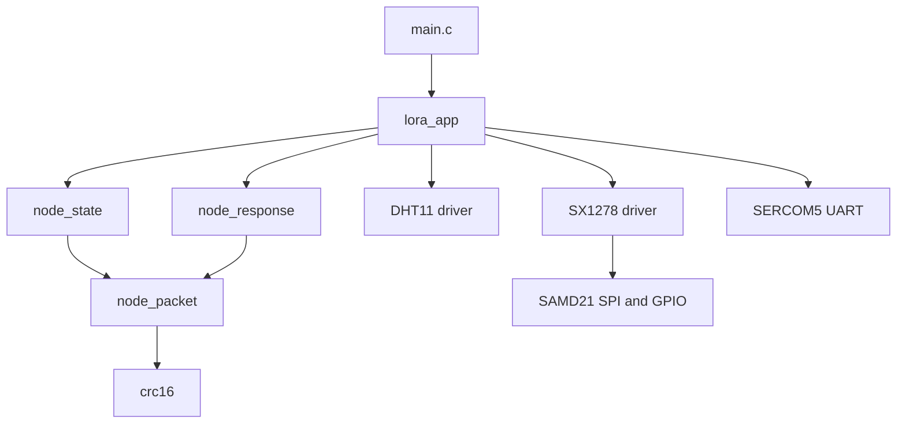
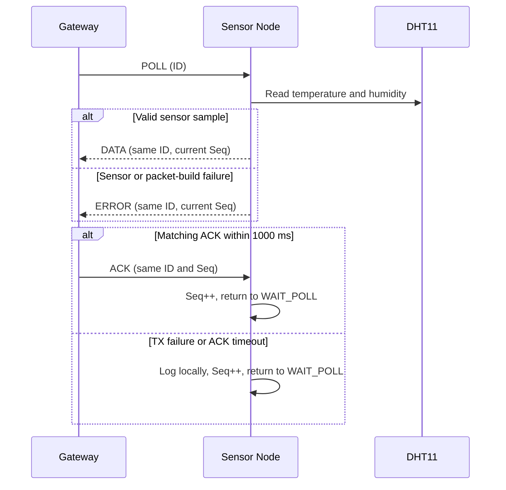

# LoRa V1 Sensor Node

## Overview

This repository contains firmware for a continuously powered LoRa sensor node
built with an ATSAMD21G17D, an Ai-Thinker LoRa-02/SX1278, and a DHT11 sensor.
The node waits for a `POLL` from a gateway, reads the sensor, transmits one
`DATA` or `ERROR` packet, and waits up to 1000 ms for a matching `ACK`.

The V1.1 node:

- uses one firmware image for both RX and TX;
- never transmits sensor data periodically;
- supports only `POLL`, `DATA`, `ACK`, and `ERROR` packets;
- uses application CRC-16/CCITT-FALSE in addition to SX1278 hardware CRC;
- increments its 16-bit sequence once when a transaction finishes;
- does not retry a response at the application layer.

## Note: Using More Than One Node

Each physical node must use a unique address. Before building firmware for a
node, change `LORA_APP_NODE_ADDRESS` in `src/app/lora_app.c`:

```c
/* Node 1 */
#define LORA_APP_NODE_ADDRESS 0x01U

/* Node 2 */
#define LORA_APP_NODE_ADDRESS 0x02U
```

Build and flash each board separately after selecting its address. Valid node
addresses are `0x01` through `0xFE`, `0x00` belongs to the gateway and `0xFF`
is reserved. The gateway must set `Dest` to the intended node address in each
`POLL` and `ACK`. Rebuilding overwrites the default `.hex` output, so copy or
rename each image, for example `node_01.hex` and `node_02.hex`, before building
the next node.

## Architecture

Hardware access is kept in the integration and driver layers. The state,
response, packet, and CRC modules are pure C and can be tested on a host PC.



| Path | Responsibility |
| --- | --- |
| `src/main.c` | Initializes Harmony and repeatedly runs the app and `SYS_Tasks()` |
| `src/app/lora_app.*` | Integrates radio RX/TX, DHT11, UART logging, and timer ticks |
| `src/app/node_state.*` | Controls `WAIT_POLL`, `WAIT_TX_RESULT`, and `WAIT_ACK` |
| `src/app/node_response.*` | Builds `DATA` or `ERROR` responses |
| `src/protocol/node_packet.*` | Validates, encodes, and decodes V1 packets |
| `src/protocol/crc16.*` | Calculates CRC-16/CCITT-FALSE |
| `src/drivers/` | Contains DHT11, SX1278, and SAM D21 hardware access |
| `src/config/default/` | Contains generated MPLAB Harmony configuration |
| `lora_TX.X/` | Contains the MPLAB X project |

## Packet Flow



All packets use this wire layout:

```text
Type | Src | Dest | ID | Len | Payload | Seq | CRC
 1 B   1 B   1 B   1 B   1 B    Len B    2 B   2 B
```

Multi-byte fields are big-endian. The gateway address is `0x00`, the current
node address is `0x01`, and the maximum packet length is 64 bytes. An invalid
length, Type, address, direction, or CRC causes the packet to be ignored.

## Pin Table

All signals use 3.3 V logic. Signal direction is relative to the SAM D21.

| SAM D21 pin | Connected device pin | Direction | Purpose |
| --- | --- | --- | --- |
| `3.3V` | LoRa-02 `VCC` | Power | Radio supply |
| `GND` | LoRa-02 `GND` | Power | Common ground |
| `PA16` | LoRa-02 `MOSI` | Output | SERCOM1 SPI data to radio |
| `PA17` | LoRa-02 `SCK` | Output | SERCOM1 SPI clock |
| `PA19` | LoRa-02 `MISO` | Input | SERCOM1 SPI data from radio |
| `PA18` | LoRa-02 `NSS/CS` | Output | Active-low chip select |
| `PA10` | LoRa-02 `RESET` | Output | Active-low radio reset |
| `PA11` | LoRa-02 `DIO0` | Input | `RxDone` and `TxDone` indication |
| `3.3V` | DHT11 `VCC` | Power | Sensor supply |
| `GND` | DHT11 `GND` | Power | Common ground |
| `PA00` | DHT11 `DATA` | Bidirectional | Single-wire sensor data |
| `PA22` | UART adapter RX | Output | SERCOM5 debug UART TX |

Use a pull-up resistor on DHT11 DATA if the sensor module does not include one.
Attach a 433 MHz antenna before transmitting, and never apply 5 V to the radio
or MCU GPIO pins.

## Build

Required toolchain:

- MPLAB X IDE v6.30
- MPLAB XC32 v5.10
- Microchip SAMD21 DFP 3.7.262.

Open `lora_TX.X` in MPLAB X and build the `default` configuration, or run the
following commands from the repository root after adding the MPLAB/XC32 tools
to `PATH`:

```powershell
make -C lora_TX.X CONF=default build
make -C lora_TX.X CONF=default clean
```

The production image is generated at:

```text
lora_TX.X/dist/default/production/lora_TX.X.production.hex
```

Program the board through MPLAB X and monitor SERCOM5 at 115200 baud, 8 data
bits, no parity, and 1 stop bit.

## Log Output


```

UART lines start with `status:` for normal events or `error:` for failures.
Binary packets are always logged with an explicit length and hexadecimal bytes;
they are never printed as C strings.

```text
status: LoRa-02 configuration: 433 MHz, SF7, BW125, CR4/5, CRC enabled
status: sensor node ready; waiting for POLL
status: rx len=9 hex=01 00 01 2A 00 00 00 BC 1B
status: tx len=13 hex=02 01 00 2A 04 00 FA 02 58 00 00 53 D4
status: ACK accepted
```

Typical failure messages include:

```text
error: DHT11 initialization failed
error: LoRa TX failed
status: ACK timeout
status: RX frame ignored
```

Host tests and firmware builds do not replace radio hardware verification. A
gateway fixture and two compatible radios are still required to verify RF
timing, error injection, and long-running transactions.
