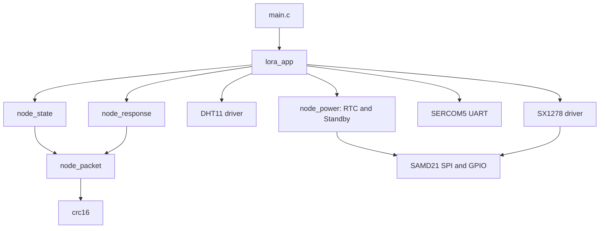

# LoRa V1 Sensor Node

## Overview

This repository contains firmware for a LoRa sensor node with RTC wakeup
built with an ATSAMD21G17D, an Ai-Thinker LoRa-02/SX1278, and a DHT11 sensor.
After initialization, the node sleeps for about 60 seconds, reads DHT11 once, sends one
`DATA` or `ERROR` packet, immediately arms RX, and waits for a matching `ACK`.
It ends the cycle on ACK, ACK timeout, or TX failure, then waits another
60 seconds from the end of the cycle. The SAM D21 enters Standby and the radio
enters Sleep during this interval. There is no application retry.

This is **MVP3: autonomous uplink with Standby and RTC wakeup**. Software and
host verification are complete; board wake/current acceptance is pending.
The legacy `POLL` packet remains
in the wire codec but no longer triggers sampling. A gateway must accept
unsolicited `DATA`/`ERROR` and echo the node's ID/Seq in its ACK; a gateway that
only polls nodes must be updated separately.

- ACK timeout is 1000 ms from successful blocking TX completion; an ACK
  observed at exactly 1000 ms is late. Wrong frames never extend the deadline.
- TX uses the existing driver's bounded 3000 ms timeout argument.
- The node creates an 8-bit ID and a 16-bit Seq in RAM, initially zero. Both
  advance once per finished cycle, including TX failure, and wrap naturally.
  Standby retains them. Reset restarts them; duplicate detection across resets
  is outside this MVP.
- DATA/ERROR payloads, byte order and CRC-16/CCITT-FALSE remain unchanged.
- Sensor initialization/read/value failure sends one ERROR and still waits
  for ACK. A local build failure ends the cycle without transmitting.

## Note: Using More Than One Node

Each physical node must use a unique address. Before building firmware for a
node, change `LORA_APP_NODE_ADDRESS` in `src/app/lora_app.c`:

```c
/* Node 1 */
#define LORA_APP_NODE_ADDRESS 0x01U

/* Node 2 */
#define LORA_APP_NODE_ADDRESS 0x02U
```

Build and flash each board separately after selecting its address. Valid node
addresses are `0x01` through `0xFE`, `0x00` belongs to the gateway and `0xFF`
is reserved. The gateway must set `Dest` to the intended node address in each
`ACK`. Rebuilding overwrites the default `.hex` output, so copy or
rename each image, for example `node_01.hex` and `node_02.hex`, before building
the next node.

## Architecture

Hardware access is kept in the integration and driver layers. The state,
response, packet, and CRC modules are pure C and can be tested on a host PC.


```mermaid
flowchart TD
    MAIN[main.c] --> APP[lora_app]
    APP --> STATE[node_state]
    APP --> RESPONSE[node_response]
    STATE --> PACKET[node_packet]
    RESPONSE --> PACKET
    PACKET --> CRC[crc16]
    APP --> DHT[DHT11 driver]
    APP --> RADIO[SX1278 driver]
    APP --> UART[SERCOM5 UART]
    APP --> POWER[node_power: RTC and Standby]
    POWER --> PLATFORM
    RADIO --> PLATFORM[SAMD21 SPI and GPIO]
```

| Path | Responsibility |
| --- | --- |
| `src/main.c` | Initializes Harmony and repeatedly runs the app and `SYS_Tasks()` |
| `src/app/lora_app.*` | Integrates radio RX/TX, DHT11, UART logging, and timer ticks |
| `src/app/node_power.*` | Drains UART/SPI, verifies radio Sleep, arms RTC and enters Standby |
| `src/app/app_time.h` | Reserves TC4/TC5 for elapsed time while awake |
| `src/app/node_state.*` | Controls `WAIT_INTERVAL`, `WAIT_TX_RESULT`, and `WAIT_ACK` |
| `src/app/node_response.*` | Builds `DATA` or `ERROR` responses |
| `src/protocol/node_packet.*` | Validates, encodes, and decodes V1 packets |
| `src/protocol/crc16.*` | Calculates CRC-16/CCITT-FALSE |
| `src/drivers/` | Contains DHT11, SX1278, and SAM D21 hardware access |
| `src/config/default/` | Contains generated MPLAB Harmony configuration |
| `lora_TX.X/` | Contains the MPLAB X project |

## Packet Flow

```mermaid
sequenceDiagram
    participant G as Gateway
    participant N as Sensor Node
    participant D as DHT11

    N->>N: Radio Sleep + MCU Standby; RTC wakes after about 60 seconds
    N->>D: Read temperature and humidity once
    alt Valid sensor sample
        N-->>G: DATA (node ID, current Seq)
    else Sensor failure
        N-->>G: ERROR (node ID, current Seq)
    end
    N->>N: Arm RX immediately after TX completion
    alt Matching ACK before 1000 ms
        G->>N: ACK (same ID and Seq)
        N->>N: Finish cycle; ID++, Seq++, WAIT_INTERVAL
    else TX failure or ACK timeout
        N->>N: Log locally; ID++, Seq++, WAIT_INTERVAL
    end
```

All packets use this wire layout:

```text
Type | Src | Dest | ID | Len | Payload | Seq | CRC
 1 B   1 B   1 B   1 B   1 B    Len B    2 B   2 B
```

Multi-byte fields are big-endian. The gateway address is `0x00`, the current
node address is `0x02`, and the maximum packet length is 64 bytes. An invalid
length, Type, address, direction, or CRC causes the packet to be ignored.

## Elapsed Time

`src/app/app_time.h` reserves the unused **TC4/TC5 pair** as a 32-bit counter
clocked by GCLK0 (48 MHz) with a /1024 prescaler. Continuous synchronized COUNT
reads and fractional millisecond accumulation count sensor, TX and UART work;
loop iteration counts do not determine deadlines. SysTick remains available to
the existing DHT11/radio delay routines. TC4/TC5 stops in Standby and measures
the ACK deadline only while awake.

The timer follows the [Microchip SAM D21/DA1 datasheet](https://ww1.microchip.com/downloads/aemDocuments/documents/MCU32/ProductDocuments/DataSheets/SAM-D21-DA1-Family-Data-Sheet-DS40001882.pdf)
TC pairing and READREQ COUNT synchronization contract. Clock/reset/synchronization
initialization waits are bounded and failure prevents application startup.
The timebase must be sampled at least once per hardware counter wrap (about
25 hours); normal operation samples it every application iteration. Timing
accuracy depends on the existing GCLK0 oscillator configuration. Generated
Harmony configuration is unchanged by this implementation. Timer/RF accuracy
still requires a board test.

`node_power` reserves RTC Mode 0 with GCLK1 from OSCULP32K / 32, DIV1, nominal
1024 Hz, and compare 61440 (`0xF000`). Each sleep starts from COUNT=0; compare
wakeup stops RTC and emits `INTERVAL_ELAPSED` to the state machine. The active
TC clock is not advanced artificially. Standby preserves RAM, GPIO and peripheral
configuration; `SYS_Initialize()` is not repeated after wake.

Preparation waits are bounded. UART must finish its final transmitted byte;
radio Sleep is verified by reading RegOpMode while preserving LoRa/LF bits.
The final wake-flag check and WFI run with PRIMASK set, which prevents losing a
compare interrupt just before sleep. Unrelated wakeups do not restart the timer.
RTC synchronization is checked before register accesses that could stall the
bus. Fatal power preparation/initialization faults stop sampling and TX until
reset. Existing generated startup and active radio SPI routines still contain
unbounded register/transfer waits; this change bounds the power preparation path.

The RTC interval depends on OSCULP32K tolerance, so it does not guarantee exactly
60.000 seconds. See [MCC configuration](Docs/config_MCC.md) for clock and pin settings.

## Pin Table

All signals use 3.3 V logic. Signal direction is relative to the SAM D21.

| SAM D21 pin | Connected device pin | Direction | Purpose |
| --- | --- | --- | --- |
| `3.3V` | LoRa-02 `VCC` | Power | Radio supply |
| `GND` | LoRa-02 `GND` | Power | Common ground |
| `PA16` | LoRa-02 `MOSI` | Output | SERCOM1 SPI data to radio |
| `PA17` | LoRa-02 `SCK` | Output | SERCOM1 SPI clock |
| `PA19` | LoRa-02 `MISO` | Input | SERCOM1 SPI data from radio |
| `PA18` | LoRa-02 `NSS/CS` | Output | Active-low chip select |
| `PA10` | LoRa-02 `RESET` | Output | Active-low radio reset |
| `PA11` | LoRa-02 `DIO0` | Input | `RxDone` and `TxDone` indication |
| `3.3V` | DHT11 `VCC` | Power | Sensor supply |
| `GND` | DHT11 `GND` | Power | Common ground |
| `PA00` | DHT11 `DATA` | Bidirectional | Single-wire sensor data |
| `PA22` | UART adapter RX | Output | SERCOM5 debug UART TX |

Use a pull-up resistor on DHT11 DATA if the sensor module does not include one.
Attach a 433 MHz antenna before transmitting, and never apply 5 V to the radio
or MCU GPIO pins.

## Build

Required toolchain:

- MPLAB X IDE v6.30
- MPLAB XC32 v5.10
- Microchip SAMD21 DFP 3.7.262.

Open `lora_TX.X` in MPLAB X and build the `default` configuration, or run the
following commands from the repository root after adding the MPLAB/XC32 tools
to `PATH`:

```powershell
make -C lora_TX.X CONF=default build
make -C lora_TX.X CONF=default clean
```

The production image is generated at:

```text
lora_TX.X/dist/default/production/lora_TX.X.production.hex
```

Program the board through MPLAB X and monitor SERCOM5 at 115200 baud, 8 data
bits, no parity, and 1 stop bit.

## Host Tests

With GNU make and a C11 GCC-compatible compiler on PATH, run from the root:

```powershell
make -C tests test
make -C tests/packet test
make -C tests/power test
make -C tests/radio test
```

The suites cover packet/CRC contracts, sensor error responses, autonomous
scheduling, ACK mismatch and boundary deadlines, TX/RX failure, ID/Seq and time
wrap, timer conversion, pending/spurious RTC interrupts, preparation faults and
20 simulated sleep/wake cycles. They compile with `-Wall -Wextra -Werror -pedantic`.
`make -C tests clean` removes only the named test executables. Tests are portable
host C; the hardware timer register setup and RF link still need board validation.
The local harness currently passes 79 tests. `tests/` remains ignored by Git
under the existing repository policy; these commands require the local harness.

## Log Output

UART lines start with `status:` for normal events or `error:` for failures.
Binary packets are logged with an explicit length and hexadecimal bytes.
The readiness message is:

```text
status: sensor node ready, first uplink in 60 seconds
```

Each cycle first logs `status: sleep, RTC wake in 60 seconds`, then
`status: RTC wakeup` and `status: tx len=... hex=...`. Successful TX logs
`status: RX ready, waiting for ACK`. Terminal outcomes include:

```text
status: ACK accepted
status: ACK timeout
error: LoRa TX failed
```

Other diagnostics include DHT11 initialization failure, RX setup failure and
`status: RX frame ignored`. RX observations are timestamped before UART logging;
post-TX logs count toward the ACK deadline, and terminal logging finishes before
the next 60-second interval starts.

Host tests and firmware builds do not replace hardware verification. MVP3 still
requires at least 20 actual sleep/wake cycles without reset or hang, UART evidence
with a compatible gateway, and sleep/awake current measurements. COM11 opens at
115200 baud but produced no data during a 30-second observation of the existing
board firmware; the new image has not been programmed as part of that observation.
